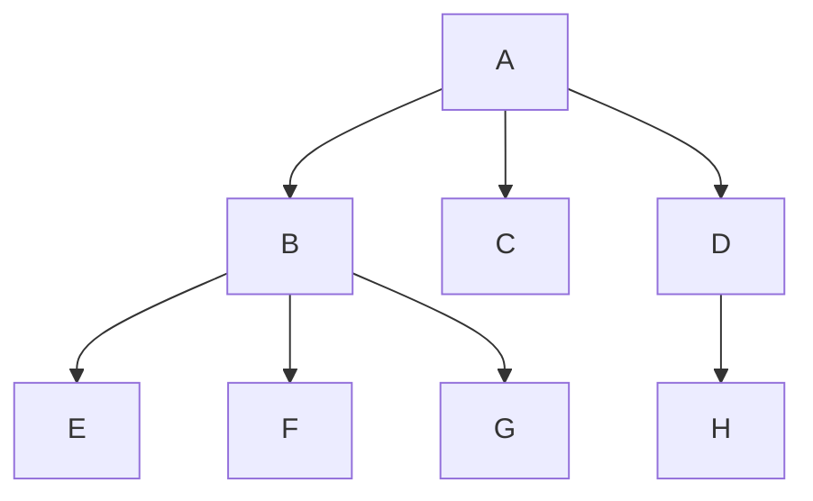
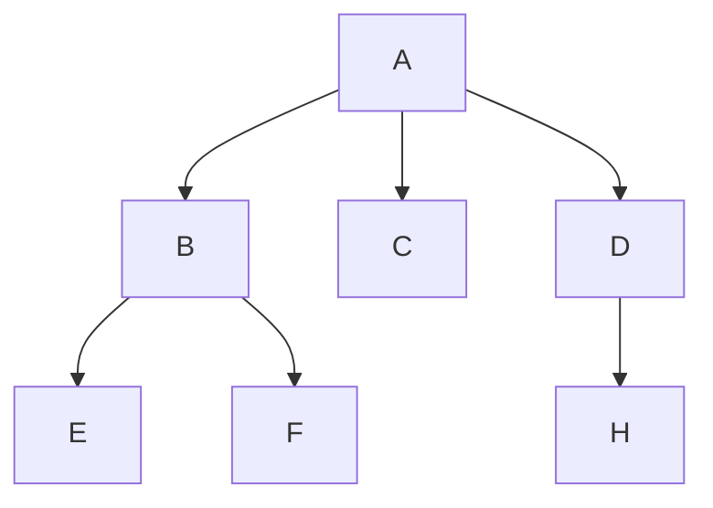
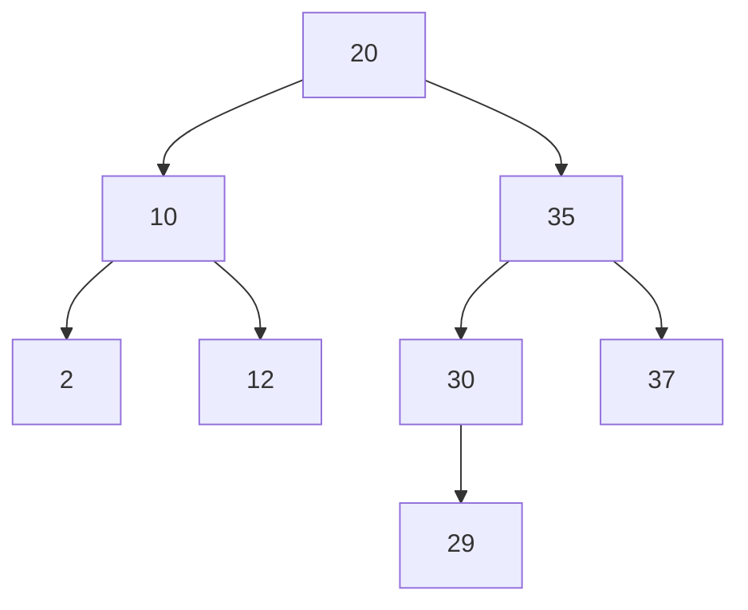
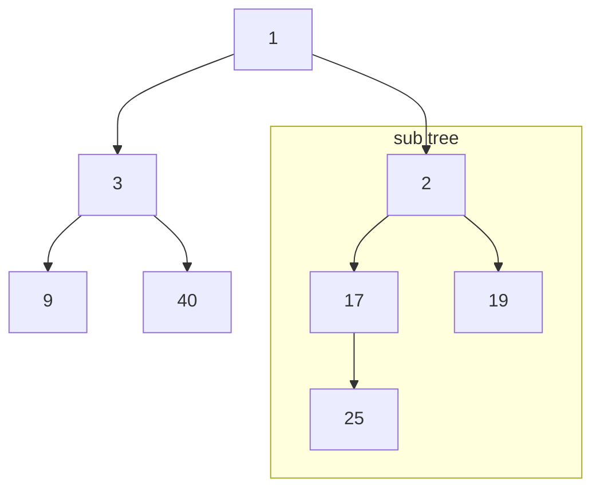
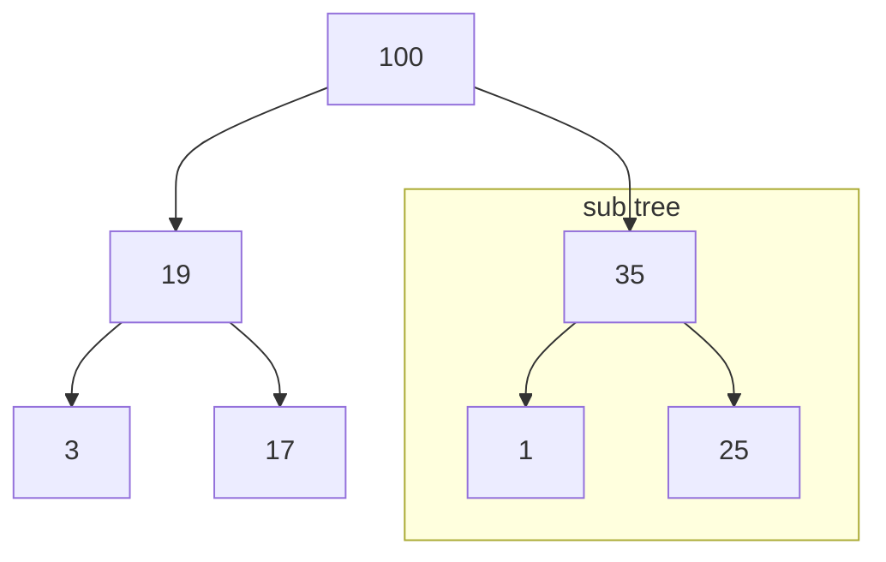

# Linear Data structure
## Array
Fix size data structure.

`[A][B][C][D]`

## Linked list
- Linear data structure similar to Array. Instead of allocates data size by size, let each node contains data and a reference to next node. With these, insertion and deletion cost are reduced significantly.
- Singly Linked List : each node have only a reference to next one.
- Doubly Linked List : each node have only a reference to next one and also previous one.
- Circular Linked List : each node points to the next one in circular.

`[A]->[B]->[C]->[D]`

## Stack
- LIFO : Last in, first out.
- Can implemented by using both array and linked list.

```
Push A
----------------
[A]
----------------

Push B
----------------
[B][A]
----------------

Push C
----------------
[C][B][A]
----------------

Pop | return C
----------------
[B][A]
----------------

Pop | return B
----------------
[A]
----------------
```

## Queue
- FIFO : First in, first out
- Can implemented by using both array and linked list.


```
Enqueue A
----------------
[A]
----------------

Enqueue B
----------------
[B][A]
----------------

Enqueue C
----------------
[C][B][A]
----------------

Dequeue | return A
----------------
[C][B]
----------------

Dequeue | return B
----------------
[C]
----------------
```

***

# Non-linear Data structure
## Tree
- Unlike all above, trees are hierarchical data structures. Each node of tree can have 0..n of children.
- The 2 ways to traverses through tree
  - Depth First Traversal : Go throught the left/right most until end of depth

    `A -> B -> E -> F -> G -> C -> D -> H`
  - Breadth First Traversal : Go throught tree by layer of depth

    `A -> B -> C -> D -> E -> F -> G -> H`



## Binary Tree
- Node in binary tree have at most 2 children(0..2).



## Binary Search Tree(BST)
- The left node have key value less than parent's key
- The right node have key value less than parent's key
- 2 rules above are apply though BST
- Because of how data is ordered. Operations(search, insertion, deletion) are depends on its height. Since at each level 2 times of data can be stored, height = log(n).



## Heap
- It's a complete tree. All level are filled until full from left most.
- It's used for implementation of priority queue.
- Min Heap : The root(top node) has minimum key value. All sub tree also have this property recursively.



- Max Heap : The root(top node) has maximum key value. All sub tree also have this property recursively.



## Hash
- Hash is function that can take arbitrary lenght of input and return fix lenght output
- Good hash function have uniformly distributed key which means if input changes just a bit output will change completely
- It can be used as cached/ database indexing
