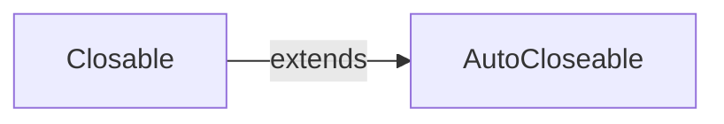
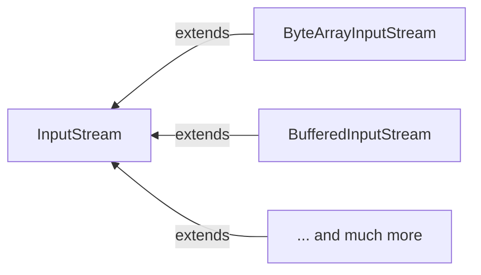
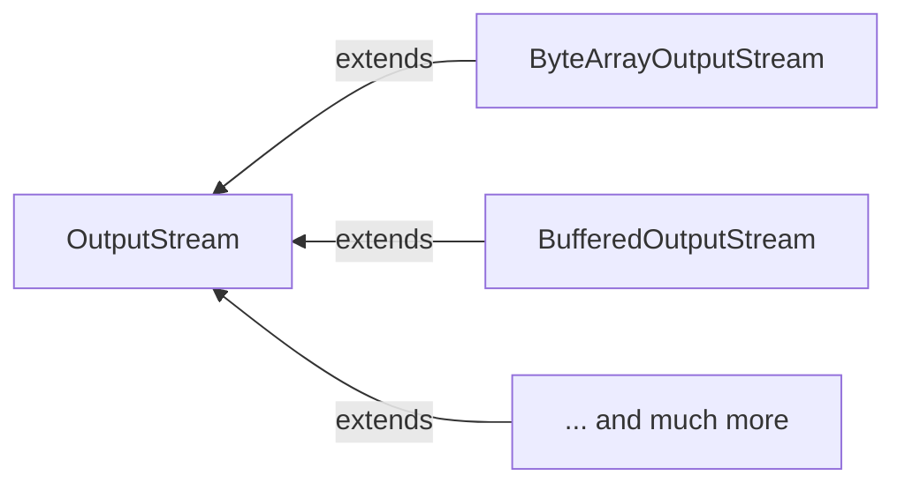
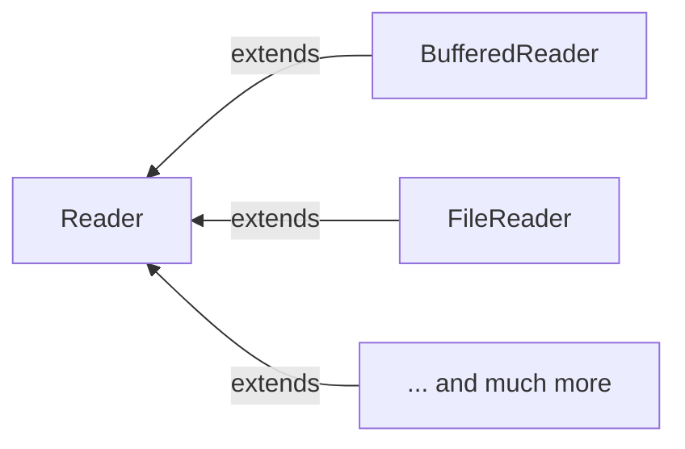

# JAVA IO
java.io is package that provides system input and output through data streams. Read write file, socket.

## Important interface/abstract
Closable: to indicate that this class hold resource that needed to be closed. For example, opens file
- void close()

AutoCloseable : same as `Closable` but method close will be invoked if object is declared in `try-with-resources` header block
- void close()



InputStream : abstract class that representing an input stream of *byte*



OutputStream : abstract class that representing an output stream of *byte*



Example implementation
- BufferedInputStream : buffered bytes in to array that support make and reset so that user can repeatly read some bytes
- BufferedOutputStream : buffered bytes in to array before flush bytes to underling OutputStream, to achive a better performace by avoid costly action

Reader: abstract class for reading *character* streams
Writer: abstract class for writing *character* streams




# Example usage of Java IO with simple echo server

Server side code
```java
@Slf4j
class EchoServer {

    @SneakyThrows
    public static void main(String[] args) {
        final int port = 8080;
        //Create a Server socket and bound to specify port for TCP connection.
        final var ss = new ServerSocket(port);
        log.info("Start server at port : " + port);

        while (true) {
            //Put socket.accept and in/out stream in try() to execute autoClosable after all communication
            try (
                //ss.accept is block until connection is created.
                var socket = ss.accept();
                //Create BufferedReader so that we can use readLine(), It need 'Reader' in constructure which can created from 'InputStream' of socket
                var inReader = new BufferedReader(new InputStreamReader(socket.getInputStream()));
                // PrintWriter so that we can print String into it.
                var outWriter = new PrintWriter(socket.getOutputStream(), true)
            ) {
                log.info("Get connection from : " + socket.getLocalAddress() + ':' + socket.getPort());

                String inputLine;
                //Get next line until it's null
                while ((inputLine = inReader.readLine()) != null ) {
                    log.info("Server received : " + inputLine);
                    outWriter.println(inputLine + " is echo");
                }

            }
        }
    }

}
```

Socket provide `InputStream` for incoming data and `OutputStearm` for outgoing data. With `BufferedReader`, we can read as String line by line. Similar to `PrintWriter` to warp so that we can print line into underlining stream.

Client side command
```shell
# this will open TCP socket in interactive mode. we can send message with enter.
nc localhost 8080
...
```
